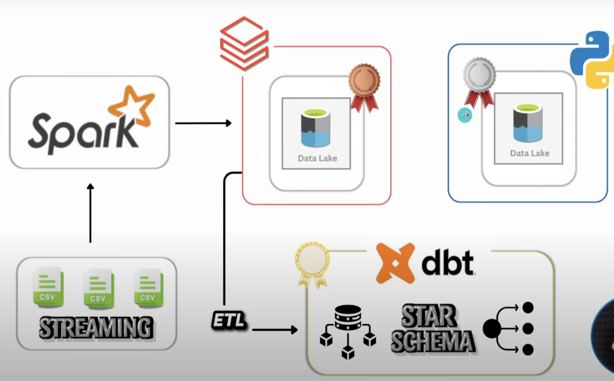

# End-to-End Data Engineering Pipeline with PySpark & DBT on Databricks

This project implements a production-grade data engineering pipeline using **Databricks**, **PySpark**, **Delta Lake**, and **DBT**, following modern data engineering best practices with the Medallion Architecture.

---

## 🔧 Technologies Used

- **Databricks** (Free Edition)  
- **PySpark** (Structured Streaming & Functions)  
- **Delta Lake** (Bronze, Silver, Gold layers)  
- **DBT** (Data modeling & transformations)  
- **Databricks SQL** (Analytics & querying)  
- **Python** (Dynamic programming & classes)  

---

## 📊 Architecture Overview

This pipeline implements a **3-layer Medallion Architecture**:

1. **Bronze Layer**: Raw CSV ingestion using PySpark Structured Streaming with checkpoint volumes  
2. **Silver Layer**: Data cleaning, transformation, and quality checks using Databricks notebooks  
3. **Gold Layer**: Analytics-ready dimensional modeling with DBT (SCD Type 2, snapshots, incremental models)  

---

## 🏗️ Key Features

- **Dynamic Data Ingestion**: Function-based PySpark notebooks for reusable, scalable processing  
- **Incremental Processing**: Checkpoint volumes ensure exactly-once delivery and cost optimization  
- **Modular Code Design**: Python classes and utilities for maintainable transformations  
- **Advanced DBT Implementation**:  
  - Incremental models with upserts  
  - Built-in snapshots for SCD Type 2  
  - YAML configurations and Jinja templating  
  - Data lineage and automated testing  
- **Interactive Analytics**: SQL queries and visualizations in Databricks  
- **Production-Ready**: Serverless compute, error handling, and monitoring capabilities  

---

## 📁 Project Structure

